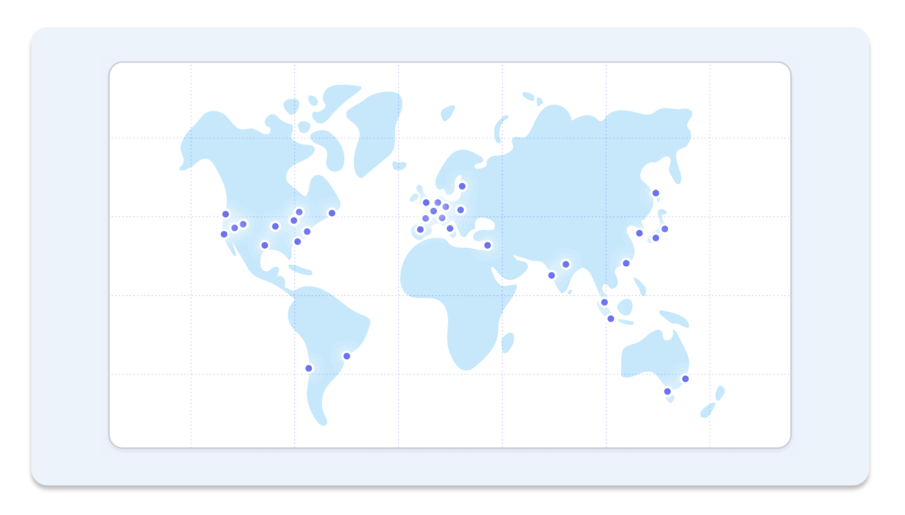
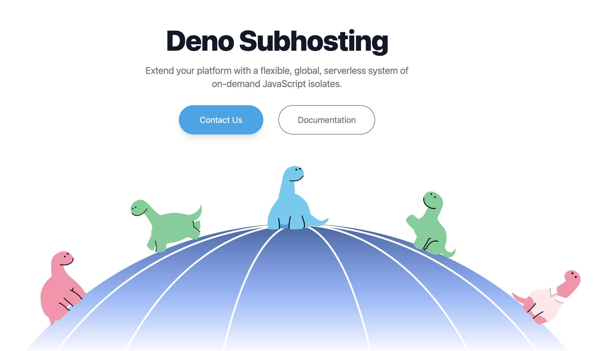

class: middle, center

日野澤歓也 @ Deno Land Inc.
---

## スピーカー

- 日野澤 歓也 (ひのさわよしや)
  - twitter @kt3k

Deno 社コアメンバー (2021 -)
- Deno の Node.js 互換機能の開発
- Deno Deploy フロントエンドの開発

---

class: inverse, center, middle

---
# Deno Deploy

- いわゆるサーバーレスホスティングサービス
- JavaScript、TypeScript、Wasm をサポート
- API は Web 互換 API + Deno 互換 API

---
# Deno Deploy

- [世界35リージョン](https://deno.com/deploy/docs/regions)に自動配信、[Anycast 技術](https://ja.wikipedia.org/wiki/%E3%82%A8%E3%83%8B%E3%83%BC%E3%82%AD%E3%83%A3%E3%82%B9%E3%83%88)で一番近いリージョンに自動的にルーティングされる
- コールドスタートは Tokyo は 170ms 程度 (EU, US, ASIA は大体この前後の数値)

  

---
# Deno Deploy で出来ること

- HTTP リクエストのサーブ

--
- 外向き HTTP リクエスト (`fetch`)

--
- 外向き TCP コネクション (`Deno.connect`)
  - mysql, postgres, redis, etc と直接通信可

--
- WebSocket のサーブ

<!--
- ファイル読み込み
  - Storage バックエンドへのネットワークアクセスに読み替えられる
- ただし tcp proxy のような使い方は NG ❌ -->

---
class: middle center inverse
# Deno Deploy の中身

---
class: middle center inverse

よくある誤解

---
class: middle center inverse

Deno Deploy って Cloudflare Workers で動いてるんでしょ?

---
class: middle center inverse

A. 違います

---
# Deno Deploy の中身

- Rust 製のカスタムランタイム
- OSS の Deno のコア部分は rusty_v8 / deno_core という crate として切り出されている
- それらの crate を再利用する形でスクラッチから作られた runtime

---
## 余談: [deno_core](https://crates.io/crates/deno_core)

- deno_core はカスタムな JS runtime を作るためのインフラ、応用例:
  - [chiselstrike](https://chiselstrike.com/) (ORM)
  - [astrodon](https://github.com/astrodon/astrodon) (デスクトップアプリフレームワーク)
  - [aurea](https://aurae.io/) (システムデーモン管理システム)

--
Deno Deploy はこの deno_core インフラを応用した JS runtime の一つと見ることが出来る

---
# Deno Deploy の中身

- Deploy の runtime を Linux VM にデプロイしている
- Kubernetes で VM のスケーリングを管理

---
class: middle center inverse

Deno Deploy はどういう使い方をして欲しいか

---
## Deno Deploy 推奨する使い方

--
- プロクシなどの用途も良いですが・・・

--
- アプリケーションを直接デプロイして欲しい

--
- (言い換えると) Edge as origin な使い方をして欲しい

---
class: middle center inverse

Deno Deploy で使える フレームワーク

---
# [Fresh](https://fresh.deno.dev/)

- Deno 公式フレームワーク
- Next.js に似たレイヤーをカバー
  - ファイルベースルーティング
  - SSR サポート
  - Preact ベース

--
- 実績多数

---
# [Aleph](https://alephjs.org/)

- Next.js / Remix に似たフレームワーク
  - SSR サポート
  - React サポート

--
  - Vue サポート(!)

--
  - Yew サポート(!) (<- Rust で書ける React)

--
- 実績あり

---
## その他のフレームワーク

- [Ultra](https://github.com/exhibitionist-digital/ultra)
  - Next.js のレイヤーをカバー
- [Oak](https://github.com/oakserver/oak)
  - Deno 界で一番古くからあるフレームワーク
  - Express のレイヤーをカバー
- [Hono](https://hono.dev/)
  - Bun, CF workers などでも動く
  - Express のレイヤーをカバー

---
class: middle center inverse

事例

---

## Deno Deploy 活用事例

https://deno.land/

- Deno の公式ホームページ
- 3rd パーティレジストリ、マニュアルなどを含んだ結構大きいサイト
- Fresh 製、[オープンソース](https://github.com/denoland/dotland)
- 8M req / day, 100+GB / day

---

## Deno Deploy 活用事例

- Deno Merch (Deno 公式グッズショップ)
  - Fresh 製、[オープンソース](https://github.com/denoland/merch)
  - Shopify API 連携
- [Fresh showcase](https://fresh.deno.dev/showcase) に50件程の利用例あり

---

## Deno Deploy 活用事例

他社の Edge worker

--
- [Netlify Edge Functions](https://docs.netlify.com/edge-functions/overview/)

--
- [Supabase Edge Functions](https://supabase.com/docs/guides/functions)

--
<small>実際、Netlify Edge Function からのリクエストは Deno Deploy 全体のリクエストのかなりの割合を占めている</small>

--
<small>実はこれらの製品は Deno Deploy の通常とは違うモードを使って実装されています</small>

---

  

---
# Deno Subhosting

- Deno Deploy をバックエンドとして、自社の Edge worker サービスとして再販出来る仕組み

--
- エンタープライズ向け

--
- ランタイムは Deno Deploy そのもの。ユーザーのソースコードを任意に編集することで、自社製品との親和性が高い Edge worker 作ることが出来る

--
使いたい方(法人)は deploy@deno.com まで

---

class: middle, center

ご清聴ありがとうございました。

https://deno.com/deploy
